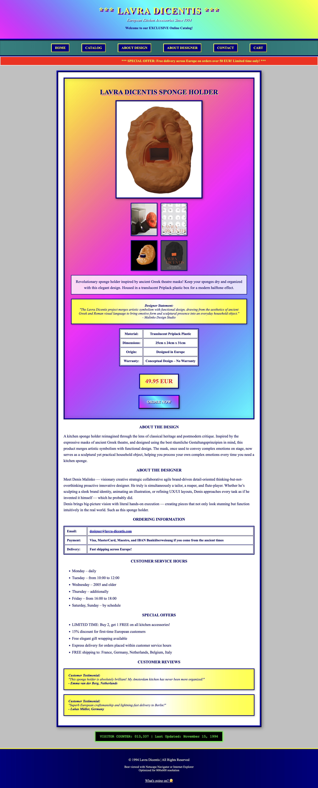

# 🧽 Lavra Dicentis

I was making a [portfolio website](https://malinko.design) for a friend when I stumbled upon
"[Lavra Dicentis](https://malinko.design/projects/lavra-dicentis)." It was a university project, and the mentioned
domain, [lavra-dicentis.com](https://lavra-dicentis.com), wasn’t even registered. It was just $11.06, so I bought it.

I wanted to do a surprise reveal for him with a funny email from the new domain — but, _obviously_, that needed a
ridiculous web page to back it up. So, on one cloudy Saturday morning, [lavra-dicentis.com](https://lavra-dicentis.com)
was born. You can go visit it (if I decided to renew the domain). Otherwise, just open `index.html` in your browser.

In all seriousness though, Denis is a great designer — [go check him out](https://malinko.design).

---

    

## About This Project

> _“A kitchen sponge holder reimagined through the lens of classical heritage and postmodern critique. Inspired by the
expressive masks of ancient Greek theatre, this product merges artistic symbolism with functional design.”_  
> — Denis Malinko

This is a parody/tribute/accidental-artifact: a retro-styled 90s online catalog for **Lavra Dicentis Kitchen
Accessories**.

- Pure HTML + CSS (single file)
- Netscape Navigator vibes, complete with `<marquee>` and a "visitor counter"
- Real (or fake) testimonials, blinking text, weird opening hours, and a working email order button
- No build process, no JavaScript frameworks, no dependencies — just open `index.html` in your browser.

## Demo

- [lavra-dicentis.com](https://lavra-dicentis.com)  
  (If the site is dead, see the raw [`index.html`](./index.html) instead!)

## How to run locally

1. Download [`index.html`](./index.html).
2. Open it in your browser.  
   (Yes, that's literally it.)

## Screenshots

## Credits

Original concept and visuals by [Denis Malinko](https://malinko.design)